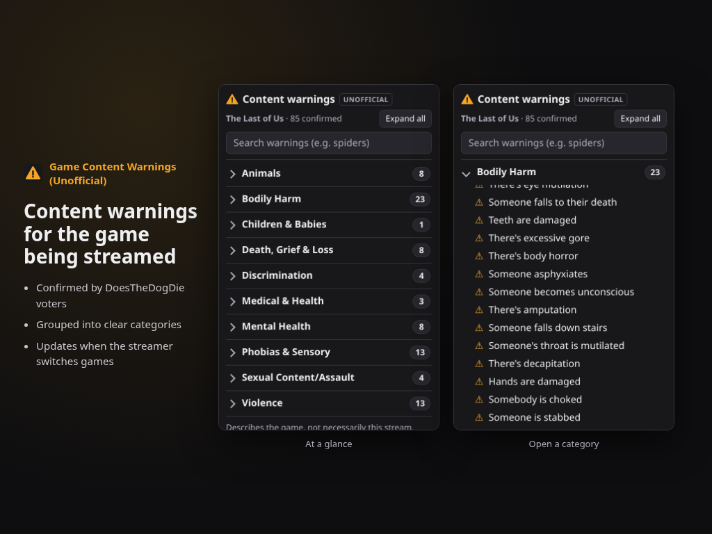

# Game Content Warnings (Unofficial)

A Twitch panel extension that lists the content warnings
[DoesTheDogDie.com](https://www.doesthedogdie.com) voters have confirmed for the game a channel is
streaming, and updates by itself when the streamer switches category.

> **Unofficial.** Not affiliated with or endorsed by DoesTheDogDie.com, and not made by Twitch.
> Warning data is crowd-sourced and may be incomplete: the absence of a warning never means the
> content is absent. Powered by [DoesTheDogDie.com](https://www.doesthedogdie.com).



## What viewers see
- Only confirmed **Yes** warnings (Yes votes outnumber No; a "few votes" tag marks thin data)
- Grouped under broad categories that start collapsed, with search at the top
- No story spoilers and no extra detail: just the triggers
- Light and dark themes, works on mobile

Streamers can correct a wrong game match on the configuration page. Nothing else is configurable,
so viewers always see every confirmed warning, unedited.

**Privacy:** the extension stores no information about viewers. See [Privacy Policy](https://cyber31415.github.io/game-content-warnings/privacy.html)
and [Terms](https://cyber31415.github.io/game-content-warnings/terms.html).

## How it works
```
Viewer panel (Twitch CDN) --JWT--> EBS (Node.js) --> Twitch Helix: channel's current category
                                       |----------> DoesTheDogDie API v3 (cached, rate-limited)
Streamer changes category --> EventSub channel.update --> EBS --> Extension PubSub --> panels re-render
```
- `ebs/`: Extension Backend Service (Fastify, node:sqlite cache, zod-validated upstream data)
- `frontend/`: panel + config page, plain TypeScript compiled to readable ES modules (no bundler)
- `shared/`: API types shared by both
- `docs/`: [setup and deployment](docs/SETUP.md), [Developer Console worksheet](docs/CONSOLE.md),
  [DDD terms notes](docs/ddd-terms-notes.md)

## Development
Everything runs from a project-local virtual environment (Node 24, Twitch CLI, Python + Playwright):

```sh
bash scripts/bootstrap-venv.sh
source .venv/bin/activate          # or .venv/bin/activate.fish
npm install
npm test && npm run typecheck
```

You need your own [DoesTheDogDie API key](https://www.doesthedogdie.com/api) in `.env`
(copy `.env.example`). Real DDD responses are never committed (DDD's terms don't allow
redistributing their data); capture them locally to enable the fixture tests and the mock server:

```sh
node --env-file=.env scripts/capture-ddd-fixtures.ts
bash scripts/local-stack.sh                 # Twitch CLI mock API + mock DDD + EBS + HTTPS dev server
.venv/bin/python scripts/e2e-local.py       # browser end-to-end checks
```

## Credits
Content-warning data: [DoesTheDogDie.com](https://www.doesthedogdie.com), used under its API terms.
"Does the Dog Die?" is a trademark of its owner. Twitch is a trademark of Twitch Interactive, Inc.

## License
Code: [MIT](LICENSE). This license covers this repository's code only, not DoesTheDogDie.com data
or trademarks.
